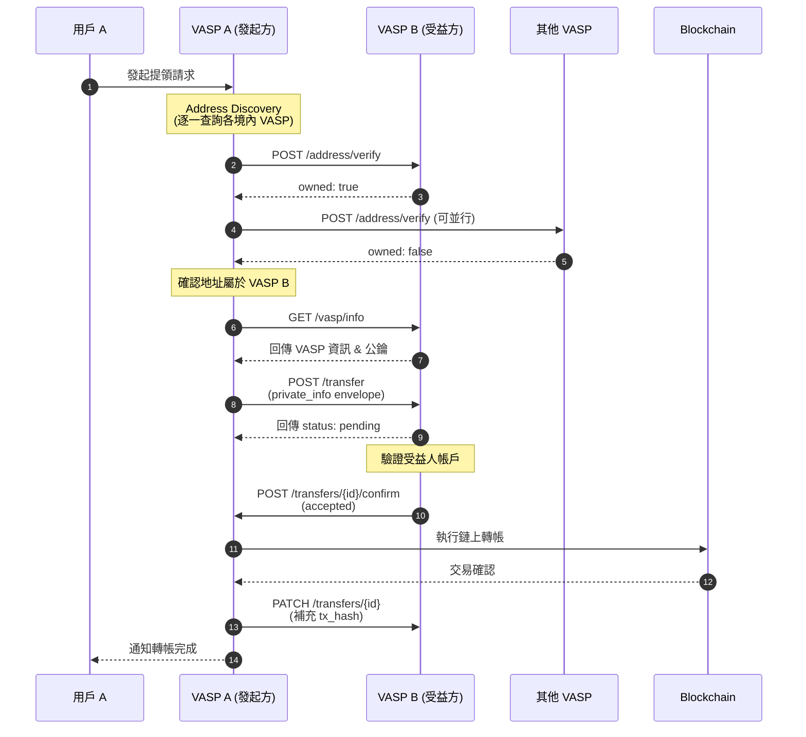
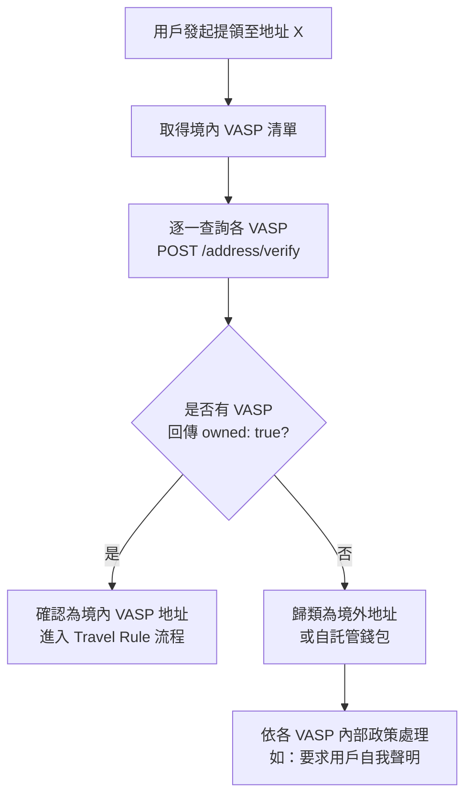

# domestic-travel-rule-api-spec

## 目錄

1. [概述](#1-概述)
2. [認證與安全](#2-認證與安全)
3. [API Endpoints](#3-api-endpoints)
4. [資料模型](#4-資料模型)
5. [錯誤處理](#5-錯誤處理)
6. [流程範例](#6-流程範例)
7. [附錄](#7-附錄)

## 1. 概述

### 1.1 目的

本文件定義境內虛擬資產服務提供商（VASP）之間實作 Travel Rule 所需的 API 規格，使各 VASP 能夠：

- 查詢目標地址是否屬於境內 VASP
- 交換交易相關的發起人/受益人資訊
- 確認或拒絕交易資料

### 1.2 適用範圍

- 境內 VASP 對境內 VASP 的虛擬資產轉帳
- 達到 Travel Rule 門檻的交易（依主管機關規定）

### 1.3 版本資訊

| 版本 | 日期 | 說明 |
|------|------|------|
| 1.0 | 2024-01-21 | 初版 |
| 2.0 | 2025-02-11 | 加入 Nonce 防重放機制、公鑰過期時間、Memo/Tag 支援、移除 Registry 依賴 |
| 2.1 | 2026-03-26 | 第三次技術會議：physical_address 結構化、date_of_birth 格式放寬、identification type 擴充、Rate Limit 定案、config versioning |
| 2.1.1 | 2026-04-10 | RSA+AES 加密機制（`private_info`）、`/transfers/{id}/confirm` 受益人資訊改為條件必填、錯誤回應識別碼欄位釐清、**移除 `company_registration`**（breaking，由 `business_registration` 取代） |
| 2.2 | 2026-05-11 | 第四次技術會議：vasp_id 命名規則、地址暫存與例外情境、transfer_id 格式、expires_at 生命週期、廣播失敗同步、vout 欄位、資料回補端點、shared_secret 共享機制 |

### 1.4 術語定義

| 術語 | 說明 |
|------|------|
| Originator | 發起人，發起轉帳的用戶 |
| Beneficiary | 受益人，接收轉帳的用戶 |
| Originating VASP | 發起方 VASP，處理發起人轉帳請求的交易所 |
| Beneficiary VASP | 受益方 VASP，受益人所屬的交易所 |
| Transfer | 一筆需要交換 Travel Rule 資料的轉帳 |

## 2. 認證與安全

### 2.1 傳輸層安全

- **強制使用 HTTPS**（TLS 1.2 以上）
- **僅允許各業者提供之白名單 IP 呼叫**

### 2.2 API 認證

所有 API 請求必須包含以下 Headers：

```
X-VASP-ID: {vasp_id}
X-Timestamp: {ISO8601_timestamp}
X-Signature: {request_signature}
X-Nonce: {unique_random_string_32_chars}
```

> **[v2.0 新增] X-Nonce 防重放攻擊機制**
>
> 每個 API 請求必須包含一個唯一的 32 字元隨機字串作為 Nonce。接收方 VASP 應：
>
> 1. 檢查該 Nonce 是否已被使用過（建議保留至少 24 小時的 Nonce 記錄）
> 2. 若 Nonce 重複，回傳 `409 Conflict` 錯誤（錯誤代碼 `DUPLICATE_NONCE`）
> 3. 將 Nonce 納入簽章計算，確保攻擊者無法竄改 Nonce 值
>
> **威脅情境**：攻擊者可能攔截合法的 `/transfer` 請求，在簽章過期前重複發送相同請求，可能造成重複交易或資料洩漏。Nonce 機制可有效防止此類重放攻擊。

#### 簽章計算方式

```
signature = HMAC-SHA256(
  key: shared_secret,
  message: "{method}\n{path}\n{timestamp}\n{nonce}\n{body_hash}"
)
body_hash = SHA256(request_body)
```

> **[v2.0 變更]** 簽章計算中新增 `{nonce}` 欄位，確保 Nonce 與簽章綁定，防止攻擊者替換 Nonce 後重送請求。

#### shared_secret 共享機制

> **[v2.2 新增] 第四次技術會議決議（提案 15）**
>
> `shared_secret` 用於 HMAC-SHA256 簽章計算。由於 mTLS 已於 v2.2 自規格移除，`shared_secret` 為目前**唯一的 VASP 身分認證機制**。
>
> **Phase 1 共享方式**：由**公會秘書處統一產生並分發**。
>
> - 秘書處為每一對互通的 VASP 產生獨立的 `shared_secret`（pairwise），避免單一密鑰外洩波及全網
> - 透過安全管道（如 PGP 加密郵件、面對面）交付
> - **輪換頻率**：建議每年輪換一次；懷疑外洩時應立即向秘書處申請重新分發
> - `shared_secret` 屬高敏感憑證，不得以明文存入程式碼或版本控制

### 2.3 敏感資料加密

發起人/受益人的個人資訊（PII）應使用接收方 VASP 的公鑰進行加密：

- **加密演算法**：RSA-OAEP
- **加密欄位**：包含 originator 與 beneficiary 的 object 物件

> **[v2.1 新增] 加密演算法統一規範與流程**
>
> 1. 統一採用 RSA-OAEP
> 2. 允許 RSA-2048 跟 RSA-4096 ，但建議採用 RSA-4096，避免 RSA-2048 在 2030 年左右強度不足的問題
>
#### 金鑰輪換機制

> **[v2.0 新增] VASP 間金鑰輪換流程**
>
> 在第一階段的分散式架構下（無中央 Registry），各 VASP 透過以下機制管理金鑰輪換：
>
> 1. 每個 VASP 的 `GET /vasp/info` 回應中，`public_keys` 陣列包含公鑰的 `expires_at` 欄位
> 2. 各 VASP 應定期呼叫其他 VASP 的 `GET /vasp/info`，建議頻率不低於金鑰過期時間的一半（例如：金鑰有效期 1 年，則至少每 6 個月查詢一次）
> 3. 當偵測到目標 VASP 的公鑰即將過期（建議提前 30 天），應主動取得新公鑰
> 4. 金鑰輪換期間，VASP 可同時保留新舊公鑰（舊鑰 status 設為 `rotating`，新鑰 status 設為 `active`），確保轉換期間不影響服務
>
> **注意**：此為第一階段簡易做法。後續版本應規劃更完善的金鑰管理機制（如集中式金鑰目錄或憑證機制），避免持續依賴手動傳遞公鑰。

#### revoked 金鑰保留期限

> **[v2.2 新增] 第四次技術會議決議（提案 3）**
>
> 為避免 `public_keys` 清單隨輪換無限膨脹：
>
> - **對外公開**：`revoked` 金鑰應於 `GET /vasp/info` 的 `public_keys` 陣列保留**至少 90 天**，供對方辨識歷史訊息所用金鑰；超過 90 天後可移除
> - **內部保存**：接收方 VASP 應於本地保存對應 RSA private key **至少 5 年**，以解密資料保留期間內的歷史 `private_info` envelope

### 2.4 IP 白名單

各 VASP 應維護境內 VASP 的 IP 白名單，僅接受來自已註冊 VASP 的請求。

## 3. API Endpoints

### Base URL

```
https://api.{vasp-domain}/travel-rule/v1
```

### 3.1 VASP 資訊

#### GET /vasp/info

取得該 VASP 的基本資訊與公鑰。

> 各 VASP 應定期呼叫此 API 以取得最新公鑰。呼叫頻率應參考回應中 `public_keys[].expires_at` 欄位，在公鑰過期前主動更新。

**Request Headers**

```
X-VASP-ID: VASP_A
X-Timestamp: 2024-01-21T10:00:00Z
X-Signature: {signature}
X-Nonce: {unique_random_string_32_chars}
```

**Response**

```json
{
  "vasp_id": "VASP_B",
  "legal_name": "某某交易所股份有限公司",
  "display_name": "交易所 B",
  "lei_code": "5493001KJTIIGC8Y1R12",
  "jurisdiction": "TW",
  "registered_services": [
    {
      "service_type": "exchange",
      "registered": true,
      "license_number": "FSC-VASP-2024-001"
    },
    {
      "service_type": "transfer",
      "registered": true,
      "license_number": "FSC-VASP-2024-001"
    },
    {
      "service_type": "custody",
      "registered": true,
      "license_number": "FSC-VASP-2024-001"
    }
  ],
  "supported_assets": [
    {
      "symbol": "BTC",
      "network": "bitcoin"
    },
    {
      "symbol": "ETH",
      "network": "ethereum"
    },
    {
      "symbol": "USDT",
      "network": "ethereum"
    }
  ],
  "public_keys": [
    {
      "kid": "key-2024-001",
      "algorithm": "RSA-2048",
      "key": "-----BEGIN PUBLIC KEY-----\nMIIBIjANBgkq...\n-----END PUBLIC KEY-----",
      "status": "active",
      "created_at": "2024-01-01T00:00:00Z",
      "expires_at": "2025-01-01T00:00:00Z"
    }
  ],
  "endpoints": {
    "address_verify": "https://api.vasp-b.com/travel-rule/v1/address/verify",
    "transfer": "https://api.vasp-b.com/travel-rule/v1/transfer"
  },
  "api_version": "2.2",
  "status": "active",
  "config_version": 3,
  "config_updated_at": "2026-03-26T10:00:00Z"
}
```

**Response Fields**

| 欄位 | 類型 | 必填 | 說明 |
|------|------|------|------|
| vasp_id | string | Y | VASP 唯一識別碼 |
| legal_name | string | Y | 公司登記名稱 |
| display_name | string | Y | 顯示名稱 |
| lei_code | string | N | LEI 代碼（如有） |
| jurisdiction | string | Y | 註冊地（ISO 3166-1 alpha-2） |
| registered_services | array | Y | 註冊業務類型列表（見下表） |
| supported_assets | array | Y | 支援的資產列表 |
| public_keys | array | Y | 用於加密通訊的公鑰列表 **[v2.0 變更：由單一物件改為陣列]** |
| endpoints | object | Y | API 端點 URL |
| api_version | string | Y | 支援的 API 版本 |
| status | string | Y | 狀態：active / maintenance / inactive |
| config_version | integer | Y | **[v2.1 新增]** 設定檔版本號（遞增），用於偵測 VASP 資訊是否有變更 |
| config_updated_at | string | Y | **[v2.1 新增]** 設定檔最後更新時間（ISO 8601） |

> **[v2.2 新增] vasp_id 命名規則（提案 1）**
>
> 統一規範各家 `vasp_id` 呈現方式，消除空格與大小寫差異：
>
> - 格式：**全小寫 snake_case**，僅允許 ASCII 小寫字母、數字與底線
> - 正規表達式：`^[a-z0-9_]{3,32}$`
> - **不允許**空格、大寫字母、連字號或其他符號
> - 由**公會秘書處統一分配**，確保全網唯一不重名
> - 範例修正：`HOYA BIT` → `hoyabit`、`Maicoin` → `maicoin`、`kryptogo` 維持不變

**Public Keys 欄位** **[v2.0 新增]**

| 欄位 | 類型 | 必填 | 說明 |
|------|------|------|------|
| kid | string | Y | 金鑰唯一識別碼（Key ID） |
| algorithm | string | Y | 加密演算法（RSA-2048, RSA-4096） |
| key | string | Y | 公鑰內容（PEM 格式） |
| status | string | Y | 金鑰狀態：`active` / `rotating` / `revoked` |
| created_at | string | Y | 金鑰建立時間（ISO 8601） |
| expires_at | string | Y | 金鑰過期時間（ISO 8601） |

> **金鑰狀態說明**：
>
> - `active`：目前使用中的金鑰，其他 VASP 應使用此金鑰加密
> - `rotating`：即將淘汰的舊金鑰，仍可用於解密但不應再用於加密新訊息
> - `revoked`：已撤銷的金鑰，不可使用
>
> **[v2.2 新增]** `revoked` 金鑰應於 `public_keys` 陣列保留**至少 90 天**後方可移除；接收方應於本地保存對應 private key **至少 5 年**（見 §2.3）。

**Registered Services 欄位**

| 欄位 | 類型 | 必填 | 說明 |
|------|------|------|------|
| service_type | string | Y | 業務類型：exchange / transfer / custody |
| registered | boolean | Y | 是否已註冊該業務 |
| license_number | string | N | 許可證字號 |

> **[v2.2 釐清] license_number 欄位處置（提案 2）**
>
> 台灣目前尚無正式的 VASP 許可證字號制度。第四次技術會議決議：`license_number` **維持 optional**，現階段**可留空**，保留供未來制度上路後擴充。實作方不應因該欄位為空而拒絕請求。

**Service Types 業務類型說明**

| 類型 | 說明 | Travel Rule 影響 |
|------|------|------|
| exchange | 虛擬資產兌換 | - |
| transfer | 虛擬資產移轉 | 若未註冊，無法接收 Travel Rule 資料交換 |
| custody | 虛擬資產保管 | - |

> **重要**：呼叫方應先檢查目標 VASP 是否已註冊 transfer 業務。若該 VASP 未註冊移轉業務，後續的 /address/verify 與 /transfer API 呼叫將會失敗並回傳 SERVICE_NOT_REGISTERED 錯誤。

### 3.2 地址所有權查詢

#### POST /address/verify

查詢指定地址是否屬於該 VASP。

**Request**

```json
{
  "address": "0x742d35Cc6634C0532925a3b844Bc9e7595f8fE21",
  "network": "ethereum",
  "asset": "ETH",
  "memo": null,
  "request_id": "req_abc123"
}
```

**Request Fields**

| 欄位 | 類型 | 必填 | 說明 |
|------|------|------|------|
| address | string | Y | 要查詢的區塊鏈地址 |
| network | string | Y | 區塊鏈網路（bitcoin, ethereum, tron...） |
| asset | string | N | 資產類型（用於多資產地址） |
| memo | string | N | **[v2.0 新增]** Memo / Destination Tag（適用於 XRP, XLM, ATOM, EOS 等需要 Memo/Tag 的鏈） |
| request_id | string | Y | 請求唯一識別碼（用於冪等性） |

> **[v2.0 新增] 關於 Memo / Destination Tag**
>
> 部分區塊鏈（如 XRP、XLM、ATOM、EOS）使用共用地址搭配 Memo 或 Destination Tag 來區分不同用戶。對於這類鏈，僅查詢地址（address）可能不足以確認受益人身份，必須同時提供 `memo` 欄位。
>
> - 若該鏈不使用 Memo/Tag 機制，此欄位可為 `null` 或省略
> - 受益方 VASP 在驗證地址時，應同時比對 address 與 memo 的組合

**Response - 地址屬於該 VASP**

```json
{
  "request_id": "req_abc123",
  "owned": true,
  "vasp_id": "VASP_B",
  "vasp_name": "交易所 B",
  "address": "0x742d35Cc6634C0532925a3b844Bc9e7595f8fE21",
  "memo": null,
  "verified_at": "2024-01-21T10:00:00Z"
}
```

**Response - 地址不屬於該 VASP**

```json
{
  "request_id": "req_abc123",
  "owned": false,
  "address": "0x742d35Cc6634C0532925a3b844Bc9e7595f8fE21",
  "memo": null,
  "verified_at": "2024-01-21T10:00:00Z"
}
```

**Response Fields**

| 欄位 | 類型 | 必填 | 說明 |
|------|------|------|------|
| request_id | string | Y | 對應請求的識別碼 |
| owned | boolean | Y | 該地址是否屬於此 VASP |
| vasp_id | string | N | VASP 識別碼（owned=true 時） |
| vasp_name | string | N | VASP 名稱（owned=true 時） |
| address | string | Y | 查詢的地址 |
| memo | string | N | **[v2.0 新增]** 對應的 Memo / Destination Tag |
| verified_at | string | Y | 查詢時間（ISO 8601） |

#### 驗證結果暫存機制 **[v2.2 新增]**

> **第四次技術會議決議（提案 4）**
>
> 發起方成功驗證接收方地址（`owned=true`）後，**可暫存驗證結果**以減少重複查詢：
>
> - **暫存有效期（TTL）**：規格統一暫定 **30 天**
> - **強制失效條件**：發起方定期呼叫 `GET /vasp/info` 時，若偵測到受益方 `config_version` 遞增（代表設定變更，例如**錢包地址重新配發**），應**立即作廢**該 VASP 相關的所有地址暫存
> - 各 VASP 可依自身實作與風險判斷調整 TTL；規格層級先統一規定 30 天

#### 廣播查詢之例外情境處理 **[v2.2 新增]**

> **第四次技術會議決議（新增提案 5，提案人：拓荒數碼）**
>
> **不得將「timeout 即放行」訂為共同標準。** 若允許「逾時無回覆即視為非境內同業地址並放行」成為標準做法，業者只要消極維運、放任 endpoint timeout 即可實質規避境內 Travel Rule 確認義務，使機制形同架空。
>
> **A. 對方 VASP timeout / 無回應**
> - 各 VASP **有義務確保自身 endpoint 的可用性、健康度與即時監控**，並訂有維運補救措施
> - 當 `GET /health` 回 `healthy` 時，其餘 API 結果**必須於常規時間內返回**（常規回應時間之業界建議值見 §3.7）
> - 業者實作發生問題應**第一時間向公會反應**
> - 對方離線時的後續處理由各家依內控自行設計（不強制一致）。法遵建議：對持續無回覆者每日定時重試；若結果不一致或始終無結果，應**調整客戶風險等級或要求補正**
>
> **B. 多家 VASP 對同一 address / memo 均回 `owned=true`**
> - 屬異常情境。此情境已於 LINE 群組討論，**處理方式留待各家 VASP 依內控政策自行處理**，規格不強制統一做法

### 3.3 發送 Travel Rule 資料

#### POST /transfer

發起方 VASP 向受益方 VASP 發送 Travel Rule 資料。

**Request**

```json
{
  "transfer_id": "tr_20240121_001",
  "transaction": {
    "tx_hash": null,
    "network": "ethereum",
    "asset": "ETH",
    "amount": "1.5",
    "amount_usd": "3500.00",
    "memo": null,
    "originated_at": "2024-01-21T10:00:00Z"
  },
  "private_info": {
    "encrypted_key": "string",
    "iv": "string",
    "auth_tag": "string",
    "ciphertext": "string"
  },
  "originating_vasp": {
    "vasp_id": "VASP_A",
    "legal_name": "某某交易所股份有限公司",
    "lei_code": "5493001KJTIIGC8Y1R17"
  },
  "beneficiary_vasp": {
    "vasp_id": "VASP_B"
  },
  "encryption": {
    "kid": "key-2024-001"
  },
  "callback_url": "https://api.vasp-a.com/travel-rule/v1/callback",
  "expires_at": "2024-01-21T10:30:00Z"
}
```

> **關於 `private_info.ciphertext` 解密後內容**
>
> `POST /v1/transfer` 的 `private_info.ciphertext` 解密後為一個 JSON 物件，包含 `Originator` 與 `Beneficiary` 兩個欄位：
>
> ```json
> {
>   "originator":  { /* Originator model — 完整欄位見 §4.1 */ },
>   "beneficiary": { /* Beneficiary model — 完整欄位見 §4.1 */ }
> }
> ```
>
> **Serialization**：plaintext 在送入 AES-256-GCM 前須 **UTF-8 encode 後傳入**（建議使用 RFC 8259 標準 JSON，欄位順序不影響 GCM 加解密，但建議 sender 維持 schema 定義順序便於 debug）。

#### private_info 組成流程

```
plain_data = {
  "originator":  Originator object,
  "beneficiary": Beneficiary object
}
plaintext = utf8(JSON.stringify(plain_data))

aes_key = GenerateRandomBytes(32)        // 256-bit AES key, fresh per message
iv      = GenerateRandomBytes(12)        // 96-bit IV, MUST be unique per aes_key

ciphertext, auth_tag = AES-256-GCM-Encrypt(
  key: aes_key,
  iv: iv,
  plaintext: plaintext
)
// auth_tag 固定 16 bytes (128-bit)

encrypted_key = RSA-Encrypt(
  public_key: receiver_public_key,       // 來自 GET /vasp/info 的 active key，kid 寫進 encryption.kid
  padding: PKCS1_OAEP_PADDING,
  hash_algorithm: SHA-256,
  mgf1_algorithm: SHA-256,
  message: aes_key
)

// 所有 bytes 以 base64 編碼後填入 envelope
private_info = {
  "encrypted_key": base64(encrypted_key),
  "iv":            base64(iv),
  "auth_tag":      base64(auth_tag),
  "ciphertext":    base64(ciphertext)
}
```

**Request Fields**

| 欄位 | 類型 | 必填 | 說明 |
|------|------|------|------|
| transfer_id | string | Y | 唯一交易識別碼（**[v2.2]** 由發起方 VASP 自訂，長度上限 36 字元） |
| transaction | object | Y | 交易資訊 |
| transaction.tx_hash | string | N | 鏈上交易 hash（可後補） |
| transaction.network | string | Y | 區塊鏈網路 |
| transaction.asset | string | Y | 資產類型 |
| transaction.amount | string | Y | 轉帳金額 |
| transaction.amount_usd | string | N | 等值美元金額 |
| transaction.memo | string | N | **[v2.0 新增]** Memo / Destination Tag |
| transaction.originated_at | string | Y | 交易發起時間 |
| private_info | object | Y | **[v2.1 新增]**  敏感資料的加密資訊 |
| private_info.encrypted_key | string | Y | **[v2.1 新增]**  發起方需用受益方的 RSA 公鑰加密後的 AES Key |
| private_info.auth_tag | string | Y | **[v2.1 新增]** 資料驗證標籤 |
| private_info.iv | string | Y | **[v2.1 新增]** 初始向量 |
| private_info.ciphertext | string | Y | **[v2.1 新增]** AES 加密後的發起人與受益人資訊，內文由 originator 與 beneficiary model 組成 |
| originating_vasp | object | Y | 發起方 VASP 資訊 |
| beneficiary_vasp | object | Y | 受益方 VASP 資訊 |
| encryption | object | Y | **[v2.1.1 變更]** Envelope 加密相關 metadata（v2.1.1 起為必填，因 envelope 解密需依此判斷 RSA private key） |
| encryption.kid | string | Y | **[v2.1.1 變更]** 用於解開 `private_info.encrypted_key` 的接收方 RSA 公鑰 ID，對應 `GET /vasp/info` 回傳之 `public_keys[].kid`。沿用 v2.0 欄位名稱，但語意改為 envelope key wrap 用 |
| callback_url | string | N | 狀態更新回呼 URL |
| expires_at | string | Y | 請求過期時間（受益方 confirm 回覆期限，見下方生命週期說明） |

> **[v2.2 變更] transfer_id 命名規則（提案 7）**
>
> `transfer_id` 由**發起方 VASP 自行定義**，不再強制 `tr_{yyyyMMDD}_{流水號}` 格式（流水號跨 VASP 並發易碰撞）。
>
> - **長度上限 36 字元**（與 UUID 等長）
> - 在發起方 VASP 範圍內唯一即可；因 Header 已帶 `X-VASP-ID`，故 `(X-VASP-ID, transfer_id)` 組合即全域唯一
> - **建議**採用 UUID 或 ULID（不可預測、含時間序），範例：`tr_01HV5K8XYZP3QRT4ABCD1234EF`

> **[v2.2 新增] expires_at 生命週期（提案 10、11）**
>
> **適用範圍**（具效力）：
> - `POST /transfer` 接收當下的檢查點——收到時已過期，受益方可拒絕（回 `INVALID_REQUEST`）
> - 受益方 **confirm 回覆期限**——須於 `expires_at` 前回覆 `accepted` / `rejected`
>
> **不適用範圍**（不再具效力）：
> - transfer 已進入 `accepted` 後的 `PATCH /transfers/{id}`（以鏈上交易為準）
> - 鏈上交易已廣播後的資料補正
>
> **過期處理**：
> - `expires_at` 已過且狀態仍為 `pending` 時，受益方**可主動**標記為 `expired` 並終結流程
> - 狀態已為 `accepted` 時，受益方**不得**單方面 expire
> - **廣播優先原則**：只要發起方在 `expires_at` 前已執行鏈上簽名廣播，即便受益方收到 `PATCH` 時已過期，仍應視為有效入帳
>
> **過期時間長度（confirm 回覆期限）**：規格**預設 24 小時**；允許發起方於 `expires_at` 自訂，有效範圍 **1～72 小時**；超過 72 小時接收方可拒收並回 `INVALID_REQUEST`。

**Response**

```json
{
  "transfer_id": "tr_20240121_001",
  "status": "pending",
  "received_at": "2024-01-21T10:00:05Z",
  "message": "Transfer request received, pending verification"
}
```

**Transfer Status 狀態說明**

| 狀態 | 說明 |
|------|------|
| pending | 已收到，等待受益方驗證 |
| accepted | 受益方已確認接受 |
| rejected | 受益方拒絕 |
| expired | 請求已過期 |
| completed | 交易完成（鏈上確認） |
| failed | 交易失敗 |

### 3.4 確認/拒絕交易

#### POST /transfers/{transfer_id}/confirm

受益方 VASP 確認或拒絕 Travel Rule 資料。

**Request - 接受**

```json
{
  "status": "accepted",
  "private_info": {
    "encrypted_key": "string",
    "iv": "string",
    "auth_tag": "string",
    "ciphertext": "string"
  },
  "encryption": {
    "kid": "key-2024-001"
  },
  "confirmed_at": "2024-01-21T10:05:00Z"
}
```

> **關於 `private_info.ciphertext` 解密後內容**
>
> `POST /v1/transfer/confirm` 的 `private_info.ciphertext` 解密後為 `Confirm Beneficiary` model（定義見 §4.1）：
>
> ```json
> {
>   "account_id": "user_67890",
>   "name":       "張小明",
>   "verified":   true
> }
> ```
>
> **加密方向反轉**：與 `POST /v1/transfer` 不同，此處 envelope 由**受益方 VASP** 加密、**發起方 VASP** 解密。因此：
>
> - `encrypted_key` 用**發起方** VASP 的 RSA 公鑰封裝 AES key（與原 `POST /v1/transfer` 中使用的公鑰不同方向）
> - 對應 `encryption.kid` 為**發起方**公鑰的 kid（透過 `GET /v1/vasp/info` 取得）
>
> **Serialization**：plaintext 在送入 AES-256-GCM 前須 **UTF-8 encode 後傳入**；所有 envelope bytes（`encrypted_key` / `iv` / `auth_tag` / `ciphertext`）以 base64 編碼。詳細演算法相同於 §3.3 POST /v1/transfer 的 `private_info 組成流程`（僅 RSA 公鑰來自發起方而非受益方）。

**Request - 拒絕**

```json
{
  "status": "rejected",
  "reject_code": "BENEFICIARY_NOT_FOUND",
  "reject_reason": "The beneficiary address is not associated with any active account",
  "rejected_at": "2024-01-21T10:05:00Z"
}
```

**Request Fields**

| 欄位 | 類型 | 必填 | 說明 |
|------|------|------|------|
| status | string | Y | `accepted` / `rejected` |
| private_info | object | **條件必填** | **[v2.1 新增]** 敏感資料的加密資訊（`status=accepted` 時必填） |
| private_info.encrypted_key | string | **條件必填** | **[v2.1 新增]** 受益方需用發起方的 RSA 公鑰加密後的 AES Key（`status=accepted` 時必填） |
| private_info.iv | string | **條件必填** | **[v2.1 新增]** 初始向量（`status=accepted` 時必填） |
| private_info.auth_tag | string | **條件必填** | **[v2.1 新增]** 資料驗證標籤（`status=accepted` 時必填） |
| private_info.ciphertext | string | **條件必填** | **[v2.1 新增]** AES 加密後的受益人資訊，內文由 `Confirm Beneficiary` model 組成（見 §4.1，`status=accepted` 時必填） |
| encryption | object | **條件必填** | **[v2.2 補登]** Envelope 加密相關 metadata（`status=accepted` 時必填，因 envelope 解密需依此判斷 RSA private key） |
| encryption.kid | string | **條件必填** | **[v2.2 補登]** 用於解開 `private_info.encrypted_key` 的**發起方** RSA 公鑰 ID，對應發起方 `GET /v1/vasp/info` 回傳之 `public_keys[].kid`（`status=accepted` 時必填）。注意加密方向反轉：與 `POST /v1/transfer` 中 `kid` 指向受益方公鑰不同，此處 `kid` 指向**發起方**公鑰 |
| confirmed_at | string | **條件必填** | 確認時間（`status=accepted` 時必填） |
| reject_code | string | **條件必填** | 拒絕代碼（`status=rejected` 時必填） |
| reject_reason | string | N | 拒絕原因說明（建議填寫） |
| rejected_at | string | **條件必填** | 拒絕時間（`status=rejected` 時必填） |

> **[v2.1.1 釐清] 關於 `private_info.ciphertext` 必填性**
>
> 在 v2.1 之前，受益人確認資訊於 request body 中為 optional。自 v2.1 起引入 RSA + AES 加密機制後，受益人資訊改以 `private_info.ciphertext` 加密傳輸。
>
> 由於 confirm API 的核心用途為「受益方 VASP 將已驗證之受益人資訊安全回傳給發起方」，因此當 `status=accepted` 時，`private_info` 及其所有子欄位（包含 `ciphertext`）皆為**必填**。若 `ciphertext` 為空，代表發起方無法取得受益人驗證結果，違反 Travel Rule 的雙向資訊揭露原則。
>
> 當 `status=rejected` 時，`private_info` 不需要提供，改以 `reject_code` 與 `rejected_at` 說明拒絕原因。

**Reject Codes**

| 代碼 | 說明 |
|------|------|
| BENEFICIARY_NOT_FOUND | 找不到受益人帳戶 |
| BENEFICIARY_SUSPENDED | 受益人帳戶已停用 |
| BENEFICIARY_NAME_MISMATCH | 受益人姓名不符 |
| INVALID_DATA | 資料格式錯誤 |
| COMPLIANCE_REJECTION | 合規性拒絕 |
| INTERNAL_ERROR | 內部錯誤 |

> **[v2.2 新增] Beneficiary Name 處理方式（提案 8）**
>
> 關於受益方收到 `beneficiary.name` 後應「僅儲存」或「進行名稱比對」，採分階段做法：
>
> **Phase 1（6 月測試 ～ 2026 年底）**
> - 受益方 VASP **僅須儲存**傳入的 `beneficiary.name`，**不強制名稱比對**
> - 回覆 `accepted` / `rejected` 主要**依據對 originator info 的審查結果**決定
> - 理由：接收端無法確認對方填寫格式，大小寫與空格差異皆影響比對，初期強制比對實務困難
>
> **Phase 2（2027 年起，後續 PR）**
> - 規格新增「name normalization 規則」附錄（中文去空白＋繁簡正規化；英文去空白、大小寫不分、去 accents）
> - 建議比對門檻：Jaro-Winkler ≥ 0.85（建議值，可協商）
> - 嚴格比對的 VASP 仍可使用 `BENEFICIARY_NAME_MISMATCH` reject code

**Response**

```json
{
  "transfer_id": "tr_20240121_001",
  "status": "accepted",
  "updated_at": "2024-01-21T10:05:00Z"
}
```

### 3.5 查詢交易狀態

#### GET /transfers/{transfer_id}

查詢特定 Travel Rule 交易的狀態。

**Response**

```json
{
  "transfer_id": "tr_20240121_001",
  "status": "accepted",
  "transaction": {
    "tx_hash": "0x123abc...",
    "network": "ethereum",
    "asset": "ETH",
    "amount": "1.5",
    "block_number": 12345678,
    "confirmed_at": "2024-01-21T10:10:00Z"
  },
  "originating_vasp": {
    "vasp_id": "VASP_A",
    "legal_name": "某某交易所股份有限公司"
  },
  "beneficiary_vasp": {
    "vasp_id": "VASP_B",
    "legal_name": "某某交易所股份有限公司"
  },
  "timeline": [
    {
      "status": "pending",
      "timestamp": "2024-01-21T10:00:05Z"
    },
    {
      "status": "accepted",
      "timestamp": "2024-01-21T10:05:00Z"
    },
    {
      "status": "completed",
      "timestamp": "2024-01-21T10:10:00Z"
    }
  ],
  "created_at": "2024-01-21T10:00:00Z",
  "updated_at": "2024-01-21T10:10:00Z"
}
```

### 3.6 更新交易資訊

#### PATCH /transfers/{transfer_id}

更新交易資訊（如補充 tx_hash）。

**Request**

```json
{
  "transaction": {
    "tx_hash": "0x123abc...",
    "vout": 0,
    "block_number": 12345678
  },
  "status": "completed"
}
```

**Request Fields**

| 欄位 | 類型 | 必填 | 說明 |
|------|------|------|------|
| transaction | object | N | 交易資訊（`status=failed` 時可省略） |
| transaction.tx_hash | string | N | 鏈上交易 hash |
| transaction.vout | integer | N | **[v2.2 新增]** UTXO output index，僅 UTXO 鏈（如 `bitcoin`）需提供 |
| transaction.block_number | integer | N | 區塊高度 |
| status | string | Y | 更新後狀態（`completed` / `failed` 等） |
| failure_reason | string | 條件必填 | **[v2.2 新增]** `status=failed` 時必填。列舉：`broadcast_failed` / `insufficient_fee` / `rejected_by_node` / `other` |
| failure_message | string | N | **[v2.2 新增]** 人類可讀的失敗說明（建議填寫） |

> **[v2.2 新增] 廣播失敗的狀態同步（提案 12）**
>
> **(a) 強制同步**：發起方收到 `accepted` 後若鏈上廣播失敗且不重試，**必須**主動發送 `PATCH /transfers/{id}` 將狀態更新為 `failed`，避免受益方陷入無限等待、影響月結對帳。
>
> **(b) `failed` 狀態欄位**：`failed` 狀態下無 `tx_hash`，`transaction` 物件**可整個省略**（不應強制傳入 `null` 的 `tx_hash`，以免觸發 Schema 驗證錯誤）。

> **[v2.2 新增] vout 欄位（提案 13）**
>
> BTC 等 UTXO 鏈一筆交易可能含多個 output，僅 `tx_hash` 不足以定位受益人收到的 output，故新增 `transaction.vout`（整數）。僅在 UTXO 鏈（如 `bitcoin`）時提供，非 UTXO 鏈可省略或為 `null`。

**`failed` 狀態 Request 範例**

```json
{
  "status": "failed",
  "failure_reason": "broadcast_failed",
  "failure_message": "Transaction rejected by node: insufficient fee"
}
```

**Response**

```json
{
  "transfer_id": "tr_20240121_001",
  "status": "completed",
  "updated_at": "2024-01-21T10:10:00Z"
}
```

### 3.6a 資料回補

#### POST /transfers/{transfer_id}/amend

> **[v2.2 新增] 資料回補機制（提案 14）**

發起方 VASP 對已被 `rejected` 的 transfer 補正發起人/受益人資訊後重送，使其重新進入確認流程。依現行自律規範，境內交易於對方未完成確認時可進行資料回補；境外交易所則無回補問題。

**Request**

```json
{
  "private_info": {
    "encrypted_key": "string",
    "iv": "string",
    "auth_tag": "string",
    "ciphertext": "string"
  },
  "encryption": {
    "kid": "key-2024-001"
  },
  "amendment_reason": "name_correction",
  "amended_at": "2024-01-21T11:00:00Z"
}
```

**Request Fields**

| 欄位 | 類型 | 必填 | 說明 |
|------|------|------|------|
| private_info | object | Y | 重新加密後的發起人/受益人資訊 envelope（結構同 POST /transfer） |
| encryption.kid | string | Y | 接收方 RSA 公鑰 ID |
| amendment_reason | string | Y | 補正原因：`name_correction` / `address_correction` / `id_correction` / `other` |
| amended_at | string | Y | 補正時間（ISO 8601） |

> **補正限制條件**
>
> 依現行《防制洗錢及打擊資恐注意事項自律規範》，境內交易於對方未完成確認時**可進行資料回補**；惟完整法源條文號待補註確認。以下條件與期限為建議值，待與自律規範條文對齊後定稿：
>
> - 僅當 transfer 狀態為 `rejected` 且 `reject_code ∈ { BENEFICIARY_NAME_MISMATCH, INVALID_DATA }` 時可補正
> - 補正期限：自原 transfer 建立後 **3 個工作日**內
> - 補正成功後 transfer 重新進入一輪 confirm 流程（狀態回到 `pending`）

**Response**

```json
{
  "transfer_id": "tr_20240121_001",
  "status": "pending",
  "updated_at": "2024-01-21T11:00:05Z"
}
```

### 3.7 健康檢查

#### GET /health

檢查 API 服務狀態。

**Response**

```json
{
  "status": "healthy",
  "version": "1.0",
  "timestamp": "2024-01-21T10:00:00Z"
}
```

> **[v2.2 新增] 健康狀態與服務可用性義務（提案 5）**
>
> 當 `GET /health` 回覆 `status: "healthy"` 時，該 VASP 的其餘 API（`/address/verify`、`/transfer` 等）**必須於常規時間內返回結果**。各 VASP 有義務確保自身 endpoint 的可用性、健康度與即時監控。

**常規回應時間建議值**

「常規回應時間」之最終 SLA 由公會自律規範定案。以下為**業界常見實踐**供參考：

| 指標 | 建議值 | 說明 |
|------|--------|------|
| `GET /health` 本身回應 | ≤ 1 秒 | health check 屬輕量端點，不應有重邏輯 |
| 其餘 API 回應時間 p95 | ≤ 3 秒 | 95% 的請求應在 3 秒內完成 |
| 其餘 API 回應時間 p99 | ≤ 10 秒 | 99% 的請求應在 10 秒內完成 |
| 呼叫方 client 端逾時設定 | 30 秒 | 超過即視為該次呼叫失敗，依 §3.2 廣播查詢例外情境處理 |

> 業界對同步 REST API 的常規做法是以 p95 / p99 百分位數（而非單一固定值）描述回應時間，因為偶發的網路抖動或冷啟動不應視為違規。`/health` 本身應遠快於業務 API；呼叫方則應另設明確的 client timeout，避免單一慢回應拖垮整批廣播查詢。

## 4. 資料模型

### 4.1 Originator / Beneficiary（自然人/法人）

> **[v2.1.1 變更]** 原 `Person` 物件依語意拆分為 `Originator`（發起人）與 `Beneficiary`（受益人）。兩者 schema 結構相同，但語意差異：發起方 VASP 對 originator 擁有完整 KYC 資料，對 beneficiary 通常僅有部分資訊（多數欄位非必填）。整包透過 `private_info` envelope（見 §3.3）進行 RSA + AES 加密傳輸，欄位本身不再標 `(encrypted)`。

#### Originator（發起人）

```json
{
  "type": "natural_person | legal_person",
  "name": "string",
  "account_id": "string (at least one of account_id or address required)",
  "address": "string (blockchain address, at least one of account_id or address required)",
  "memo": "string (Memo/Tag, if applicable)",
  "identification": {
    "type": "national_id | passport | lei | tax_id | business_registration",
    "number": "string",
    "country": "string (ISO 3166-1 alpha-2)"
  },
  "date_of_birth": "string (YYYY or YYYY-MM or YYYY-MM-DD)",
  "place_of_birth": "string",
  "physical_address": {
    "country": "string (ISO 3166-1 alpha-2, e.g. TW)",
    "city": "string (city name)"
  }
}
```

#### Beneficiary（受益人）

```json
{
  "type": "natural_person | legal_person",
  "name": "string",
  "account_id": "string (at least one of account_id or address required)",
  "address": "string (blockchain address, at least one of account_id or address required)",
  "memo": "string (Memo/Tag, if applicable)",
  "identification": {
    "type": "national_id | passport | lei | tax_id | business_registration",
    "number": "string",
    "country": "string (ISO 3166-1 alpha-2)"
  },
  "date_of_birth": "string (YYYY or YYYY-MM or YYYY-MM-DD)",
  "place_of_birth": "string",
  "physical_address": {
    "country": "string (ISO 3166-1 alpha-2, e.g. TW)",
    "city": "string (city name)"
  }
}
```

#### Confirm Beneficiary（`/transfers/{id}/confirm` 回傳之受益人資訊）

> **[v2.1.1 新增]** 受益方 VASP 完成驗證後，於 `POST /v1/transfer/confirm` 回傳此物件。為 `private_info.ciphertext` 解密後的明文內容。

```json
{
  "account_id": "string",
  "name": "string",
  "verified": "boolean"
}
```

#### account_id / address 條件式必填 [v2.1 新增]

`account_id`（帳戶編碼）與 `address`（區塊鏈地址）**至少須提供其一**：

| 情境 | account_id | address | 說明 |
|------|-----------|---------|------|
| 用戶有獨立鏈上地址 | 可選 | 必填 | 一般情況 |
| 從水庫地址（omnibus address）發送 | 必填 | 可選 | 帳戶編碼與用戶 1:1 對應 |
| 兩者皆有 | 必填 | 必填 | 最佳實務 |

> **背景**：交易所在處理客戶虛擬資產發送時，可能從水庫地址（omnibus/pool address）發送，而非分配給發起人獨一無二的區塊鏈地址。經公會秘書處與主管機關確認，自律規範允許以帳戶編碼替代區塊鏈地址，因帳戶編碼與用戶為 1:1 對應。此做法亦與國際慣例一致（歐盟 TFR、新加坡 PSN02 皆採 account number or blockchain address）。

#### physical_address 大額交易必填規則 **[v2.2 釐清]**

> **第四次技術會議決議（提案 9）**
>
> 依《防制洗錢及打擊資恐注意事項自律規範》第十二條之一，移轉虛擬資產等值新臺幣三萬元以上者，應包含接收人之居住、出生或註冊營業之國家及城鎮名稱。對應欄位為 `physical_address`（v2.1 已加入結構化 `{country, city}`）：

| 交易金額（等值 TWD） | `originator.physical_address` | `beneficiary.physical_address` |
|------|------|------|
| ≥ 30,000 | **必填** | **必填** |
| < 30,000 | optional | optional |

> `city` 欄位的標準化用詞（如 `"New Taipei City"` vs `"新北市"`）待確認，將參考 ISO 3166-2:TW 或其他標準。

### 4.2 VASP

```json
{
  "vasp_id": "string",
  "legal_name": "string",
  "display_name": "string",
  "lei_code": "string",
  "jurisdiction": "string (ISO 3166-1 alpha-2)"
}
```

### 4.3 Transaction

```json
{
  "tx_hash": "string",
  "vout": "integer (UTXO output index, UTXO 鏈才需要)",
  "network": "string",
  "asset": "string",
  "amount": "string (decimal)",
  "amount_usd": "string (decimal)",
  "memo": "string (Memo/Tag, if applicable)",
  "block_number": "integer",
  "originated_at": "string (ISO 8601)",
  "confirmed_at": "string (ISO 8601)"
}
```

> **[v2.2 新增]** `vout` 為 UTXO output index。BTC 等 UTXO 鏈一筆交易可能含多個 output，僅 `tx_hash` 不足以定位受益人收到的 output。僅在 `network` 為 UTXO 鏈（如 `bitcoin`）時提供。

### 4.4 支援的區塊鏈網路

| Network ID | 說明 |
|------|------|
| bitcoin | Bitcoin 主網 |
| ethereum | Ethereum 主網 |
| tron | Tron 主網 |
| bsc | BNB Smart Chain |
| polygon | Polygon |
| arbitrum | Arbitrum One |
| optimism | Optimism |
| solana | Solana |
| xrp | **[v2.0 新增]** XRP Ledger |
| stellar | **[v2.0 新增]** Stellar |
| cosmos | **[v2.0 新增]** Cosmos Hub |
| eos | **[v2.0 新增]** EOS |

### 4.5 支援的資產類型

| Asset | Network | 說明 |
|------|------|------|
| BTC | bitcoin | Bitcoin |
| ETH | ethereum | Ethereum |
| USDT | ethereum, tron, bsc | Tether USD |
| USDC | ethereum, polygon | USD Coin |
| XRP | xrp | **[v2.0 新增]** XRP |

### 4.6 需要 Memo/Tag 的網路 **[v2.0 新增]**

以下網路在進行地址查詢與交易時，可能需要同時提供 Memo 或 Destination Tag：

| Network | Memo 欄位名稱 | 說明 |
|------|------|------|
| xrp | Destination Tag | 數字型態，用於區分同一地址下的不同用戶 |
| stellar | Memo | 文字或數字型態 |
| cosmos | Memo | 文字型態 |
| eos | Memo | 文字型態 |

> 發起方 VASP 在查詢地址及發送 Transfer 時，若目標網路屬於上述類型，**必須**提供對應的 memo 欄位。

## 5. 錯誤處理

### 5.1 HTTP 狀態碼

| 狀態碼 | 說明 |
|------|------|
| 200 | 成功 |
| 201 | 建立成功 |
| 400 | 請求參數錯誤 |
| 401 | 認證失敗 |
| 403 | 權限不足 |
| 404 | 資源不存在 |
| 409 | 衝突（如重複的 transfer_id 或重複的 nonce） |
| 422 | 資料驗證失敗 |
| 429 | 請求過於頻繁 |
| 500 | 伺服器內部錯誤 |
| 503 | 服務暫時無法使用 |

### 5.2 錯誤回應格式

```json
{
  "error": {
    "code": "INVALID_REQUEST",
    "message": "The request body is invalid",
    "details": [
      {
        "field": "originator.name",
        "message": "This field is required"
      }
    ],
    "request_id": "req_abc123"
  }
}
```

### 5.3 錯誤代碼

| 代碼 | HTTP | 說明 |
|------|------|------|
| INVALID_REQUEST | 400 | 請求格式錯誤 |
| INVALID_SIGNATURE | 401 | 簽章驗證失敗 |
| UNAUTHORIZED | 401 | 未授權的 VASP |
| FORBIDDEN | 403 | 權限不足 |
| NOT_FOUND | 404 | 資源不存在 |
| SERVICE_NOT_REGISTERED | 403 | 該 VASP 未註冊此業務（如未註冊移轉業務） |
| DUPLICATE_TRANSFER | 409 | 重複的 transfer_id |
| DUPLICATE_NONCE | 409 | **[v2.0 新增]** 重複的 Nonce（疑似重放攻擊） |
| NONCE_EXPIRED | 400 | **[v2.0 新增]** Nonce 已超過有效時間窗口 |
| KEY_EXPIRED | 400 | **[v2.0 新增]** 使用的加密金鑰已過期 |
| VALIDATION_ERROR | 422 | 資料驗證失敗 |
| RATE_LIMITED | 429 | 超過請求限制（Response Header 須包含 `Retry-After` 秒數） |
| INTERNAL_ERROR | 500 | 內部錯誤 |
| SERVICE_UNAVAILABLE | 503 | 服務暫停 |

## 6. 流程範例

> **[v2.0 變更]** 第一階段不設立中央 VASP Registry。Address Discovery 採用分散式做法：發起方 VASP 直接逐一查詢境內各 VASP，若所有查詢結果皆為否定，則將該地址歸類為境外地址或自託管錢包。

### 6.1 完整 Travel Rule 流程（第一階段：無 Registry）

```
┌─────────────────────────────────────────────────────────────────────────┐
│               Travel Rule 完整流程（第一階段：無 Registry）               │
└─────────────────────────────────────────────────────────────────────────┘

User A          VASP A                 VASP B ~ N               Blockchain
  │               │                       │                        │
  │ 1. 發起提領   │                       │                        │
  │──────────────>│                       │                        │
  │               │                       │                        │
  │               │ 2. Address Discovery (逐一查詢各 VASP)          │
  │               │   POST /address/verify                         │
  │               │──────────────────────>│                        │
  │               │                       │                        │
  │               │ 3. 回傳 owned: true   │                        │
  │               │<──────────────────────│ (假設 VASP B 擁有)     │
  │               │                       │                        │
  │               │ 4. GET /vasp/info     │                        │
  │               │──────────────────────>│                        │
  │               │                       │                        │
  │               │ 5. 回傳 VASP 資訊 & 公鑰                      │
  │               │<──────────────────────│                        │
  │               │                       │                        │
  │               │ 6. POST /transfer (private_info envelope)      │
  │               │──────────────────────>│                        │
  │               │                       │                        │
  │               │ 7. 回傳 pending       │                        │
  │               │<──────────────────────│                        │
  │               │                       │  8. 驗證受益人          │
  │               │                       │───────────────>        │
  │               │                       │                        │
  │               │ 9. POST /transfers/{id}/confirm (accepted)     │
  │               │<──────────────────────│                        │
  │               │                       │                        │
  │               │ 10. 執行鏈上轉帳      │                        │
  │               │───────────────────────────────────────────────>│
  │               │                       │                        │
  │               │ 11. PATCH /transfers/{id} (tx_hash)            │
  │               │──────────────────────>│                        │
  │               │                       │                        │
  │ 12. 通知完成  │                       │                        │
  │<──────────────│                       │                        │
  │               │                       │                        │
```

> **Address Discovery 說明**：在無 Registry 的架構下，VASP A 需對所有已知的境內 VASP 發送 `POST /address/verify` 查詢。若所有 VASP 皆回傳 `owned: false`，則判定該地址為境外地址或自託管錢包，後續依各 VASP 內部政策處理（如要求用戶填寫自我聲明等）。

### 6.2 時序圖（Mermaid）



### 6.3 Address Discovery 流程（無 Registry） **[v2.0 新增]**



> **注意**：各 VASP 需自行維護一份境內 VASP 的端點清單（Base URL）。在第一階段，此清單可透過公會秘書處統一維護與分發。後續版本可考慮建立中央 Registry 機制。

## 7. 附錄

### 7.1 VASP 註冊資訊

各 VASP 需向公會秘書處提供以下資訊，由秘書處統一維護與分發：

> **[v2.0 變更]** 第一階段不設立中央 VASP Registry，改由公會秘書處維護 VASP 清單。

| 欄位 | 說明 |
|------|------|
| vasp_id | 唯一識別碼 |
| legal_name | 公司登記名稱 |
| lei_code | LEI 代碼（如有） |
| api_endpoint | API 基礎 URL |
| public_key | 加密用公鑰 |
| ip_whitelist | 允許的 IP 列表 |
| supported_assets | 支援的資產列表 |
| contact_email | 技術聯絡信箱 |

### 7.2 測試環境

各 VASP 應提供 Sandbox 測試環境：

- **Sandbox URL**: `https://sandbox-api.{vasp-domain}/travel-rule/v1`
- **測試網路**: Hoodi (Ethereum), Testnet (Bitcoin)

### 7.3 Rate Limiting

> **[v2.1 變更]** 以下數值由第三次技術會議（2026-03-26）定案。Phase 1 暫定值，Sandbox 壓測後可滾動調整。

| 端點 | Method | 限制 | 備註 |
|------|--------|------|------|
| /address/verify | POST | 200 requests/minute | 最大業者約 100 筆/分鐘 × N-1 廣播，含 2x buffer |
| /transfer | POST | 60 requests/minute | 實際配對交易量遠低於 address verify |
| /transfers/{id} | PATCH | 30 requests/minute | 每筆最多 PATCH 1-2 次 |
| /transfers/{id} | GET | 60 requests/minute | 狀態 polling 場景 |
| /vasp/info | GET | 10 requests/minute | 低頻，取公鑰/VASP 資訊 |

**實作要點**：

- 超過限制回傳 `429 Too Many Requests`
- Response Header 須包含 `Retry-After`（秒數）
- 建議各家使用 sliding window 或 token bucket 實作
- Rate limit 以 per-VASP（依 `X-VASP-ID` header）計算，非 per-IP

### 7.4 資料保留

- Travel Rule 資料應保留至少 **5 年**
- 交易紀錄應包含完整的稽核軌跡
- **[v2.0 新增]** Nonce 記錄應保留至少 **24 小時**，用於防重放檢查

### 7.5 參考標準

- [FATF Recommendation 16](https://www.fatf-gafi.org/recommendations.html)
- [TRISA Protocol](https://trisa.io/)
- [OpenVASP](https://openvasp.org/)
- [interVASP Messaging Standard (IVMS101)](https://intervasp.org/)

### 7.6 境外地址 / 自託管錢包自我聲明參考格式 **[v2.2 新增]**

> **第四次技術會議決議（提案 6）**
>
> 若 Address Discovery 後無任何境內 VASP 擁有該地址，將歸類為境外地址或自託管錢包，須依各 VASP 內部政策要求用戶自我聲明。
>
> 本格式為**附錄級「建議格式」，非強制**——各家可自行決定是否採用，避免強迫所有 VASP 變更既有 KYC 流程。

```json
{
  "wallet_address": "0x...",
  "network": "ethereum",
  "owner_declaration": {
    "type": "self_custody | foreign_vasp",
    "owner_name": "string",
    "relationship": "self | third_party",
    "purpose": "string (用途說明)"
  },
  "proof_of_ownership": {
    "method": "satoshi_test | aopp | message_signature | none",
    "evidence": "string (簽章或交易 hash)"
  },
  "declared_at": "string (ISO 8601)"
}
```

## 變更紀錄

| 版本 | 日期 | 變更說明 | 作者 |
|------|------|------|------|
| 1.0 | 2024-01-21 | 初版發布 | - |
| 2.0 | 2025-02-11 | 見下方 v2.0 詳細變更列表 | KryptoGO |
| 2.1 | 2026-03-26 | 第三次技術會議決議：見下方 v2.1 詳細變更列表 | KryptoGO |
| 2.1.1 | 2026-04-10 | RSA+AES 加密、confirm 條件必填、移除 company_registration：見下方 v2.1.1 詳細變更列表 | KryptoGO |
| 2.2 | 2026-05-11 | 第四次技術會議決議：見下方 v2.2 詳細變更列表 | KryptoGO |

### v2.0 變更明細

| # | Section | 變更內容 | 來源 |
|---|---------|---------|------|
| 1 | 2.2 API 認證 | 新增 `X-Nonce` Header 及防重放攻擊機制說明 | Lido 建議 |
| 2 | 2.2 簽章計算 | 簽章計算加入 `{nonce}` 欄位，確保 Nonce 與簽章綁定 | Lido 建議 |
| 3 | 2.3 敏感資料加密 | 新增金鑰輪換機制說明，描述 VASP 間如何共享 rotated key | Kordan 提議 |
| 4 | 3.1 GET /vasp/info | `public_key`（單一物件）改為 `public_keys`（陣列），新增 `kid`, `status`, `created_at`, `expires_at` 欄位 | Lido 建議 |
| 5 | 3.2 POST /address/verify | 新增 `memo` 欄位，支援 XRP 等需要 Memo/Destination Tag 的鏈 | Andy 反應 |
| 6 | 3.3 POST /transfer | Request 中 `transaction` 與 `beneficiary` 新增 `memo` 欄位；新增 `encryption.kid` 欄位對應公鑰 ID | Andy 反應 + 配合 public_keys 變更 |
| 7 | 4.1 Person | 資料模型新增 `memo` 欄位 | Andy 反應 |
| 8 | 4.3 Transaction | 資料模型新增 `memo` 欄位 | Andy 反應 |
| 9 | 4.4 支援的區塊鏈網路 | 新增 xrp, stellar, cosmos, eos 網路 | Andy 反應（配合 Memo/Tag 支援） |
| 10 | 4.5 支援的資產類型 | 新增 XRP 資產 | Andy 反應 |
| 11 | 4.6 需要 Memo/Tag 的網路 | 新增整個 section，列出需要 Memo/Tag 的網路及說明 | Andy 反應 |
| 12 | 5.1 HTTP 狀態碼 | 409 說明擴充包含重複 nonce 情境 | Lido 建議 |
| 13 | 5.3 錯誤代碼 | 新增 `DUPLICATE_NONCE`, `NONCE_EXPIRED`, `KEY_EXPIRED` 錯誤代碼 | Lido 建議 + 配合 key rotation |
| 14 | 6.1 完整流程圖 | 移除 VASP Registry 角色，改為 VASP A 直接查詢各 VASP 的分散式流程 | Kordan 反應（第一階段無 Registry） |
| 15 | 6.2 時序圖（Mermaid） | 移除 VASP Registry 參與者，改為 VASP 間直接通訊的 P2P 模式 | Kordan 反應（第一階段無 Registry） |
| 16 | 6.3 Address Discovery 流程 | 新增整個 section，以 Mermaid flowchart 描述無 Registry 下的地址發現流程 | Kordan 反應 + 會議共識 |
| 17 | 7.1 VASP 註冊資訊 | 改為由公會秘書處維護 VASP 清單，而非中央 Registry | Kordan 反應 |
| 18 | 7.3 Rate Limiting | Rate Limit 數值改為 TBD，待公會秘書處統計各業者需求後確認 | 會議共識 |
| 19 | 7.4 資料保留 | 新增 Nonce 記錄保留 24 小時的要求 | Lido 建議（配合 Nonce 機制） |

### v2.1 變更明細

> 來源：第三次技術會議（2026-03-26），參考提案一、二、四

| # | Section | 變更內容 | 來源 |
|---|---------|---------|------|
| 1 | 4.1 Person | `physical_address` 由原本單一字串改為結構化物件 `{country, city}`（與其他 PII 欄位一同被外層加密機制覆蓋）；金額 ≥ 30,000 TWD 等值時為必填 | 提案 1-1 |
| 2 | 4.1 Person | `date_of_birth` 格式放寬，接受 `YYYY` / `YYYY-MM` / `YYYY-MM-DD` 三種格式 | 提案 1-2 |
| 3 | 4.1 Person | `identification.type` 新增 `lei`、`tax_id`、`business_registration`；法人優先順序：lei > tax_id > business_registration | 提案 1-4 |
| 4 | 3.3 POST /transfer | `originator.physical_address` 與 `beneficiary.physical_address` 改為結構化物件；新增 identification.type 子欄位說明 | 提案 1-1, 1-4 |
| 5 | 7.3 Rate Limiting | 所有端點 Rate Limit 數值定案（取代 TBD）：`/address/verify` 200 RPM、`/transfer` 60 RPM、`PATCH /transfers/{id}` 30 RPM、`GET /transfers/{id}` 60 RPM、`/vasp/info` 10 RPM | 提案 2 |
| 6 | 7.3 Rate Limiting | 新增實作要點：`Retry-After` header、per-VASP 計算、建議 sliding window 或 token bucket | 提案 2 |
| 7 | 3.1 GET /vasp/info | 新增 `config_version`（整數遞增）與 `config_updated_at`（ISO 8601）欄位 | 提案 4 |
| 8 | 5.3 錯誤代碼 | `RATE_LIMITED` 錯誤說明補充 `Retry-After` header 要求 | 提案 2 |
| 9 | 4.1 Person / 3.3 POST /transfer | `account_id` 與 `address` 由必填改為條件式必填（至少提供其一），允許以帳戶編碼替代區塊鏈地址 | MaiCoin 提議，自律規範對齊 |

### v2.1.1 變更明細

> 來源：第三次技術會議後續討論（Slack 回饋、PR #3、PR #4，2026-04-10）

| # | Section | 變更內容 | 來源 |
|---|---------|---------|------|
| 1 | 4.1 資料模型 | **[Breaking]** 移除 `identification.type` 的 `company_registration`；法人登記字號一律使用 `business_registration`（原本兩者語意重疊） | PR #4 Code Review |
| 2 | 4.1 資料模型 | 原 `Person` 物件依語意拆分為 `Originator`（發起人）與 `Beneficiary`（受益人）；新增 `Confirm Beneficiary` model 作為 `/transfers/{id}/confirm` 回傳的解密後內容 | PR #4 |
| 3 | 4.x 資料模型 / 3.3 POST /transfer | 新增 `private_info` 結構（`encrypted_key` / `iv` / `auth_tag` / `ciphertext`）；發起人與受益人資訊改以 RSA-OAEP + AES-256-GCM Hybrid Encryption 整包加密傳輸 | PR #3 (pia-pt), 第三次技術會議 |
| 4 | 3.3 POST /transfer | 新增 RSA + AES 加密 pseudo-code；`private_info` 取代逐欄位 `(encrypted)` 標註 | PR #3 (pia-pt) |
| 5 | 3.4 POST /transfers/{id}/confirm | `private_info` 及其子欄位（含 `ciphertext`）改為條件必填（`status=accepted` 時必填）；原 `ciphertext=N` 與父容器 `private_info=Y` 邏輯矛盾 | Slack 回饋 (MaiCoin_Pia) |
| 6 | 2.3 敏感資料加密 | 演算法收斂：移除 ECIES 選項，統一採用 RSA-OAEP；建議使用 RSA-4096（RSA-2048 仍允許但 2030 年後強度不足） | 第三次技術會議 |
| 7 | 3.3 POST /transfer | `encryption` 物件由 optional 改為必填；`encryption.kid` 語意改為「解開 `private_info.encrypted_key` 用的接收方 RSA 公鑰 ID」 | PR #4 Code Review |
| 8 | 5.2 錯誤回應格式 | 明確化錯誤回應中的識別碼欄位：`/address/verify` 用 `request_id`、`/transfer` 系列用 `transfer_id`（原範例統一用 `request_id` 易誤導實作方） | Kordan Review |

<Warning>
**v2.1.1 為 breaking change** — 移除 `company_registration` 類型、`encryption` 改必填。由於 v2.1 規格尚未有任何正式實作，不需向後相容過渡期。所有實作方請直接使用 `business_registration` 並提供 `encryption.kid`。
</Warning>

### v2.2 變更明細

> 來源：第四次技術會議（2026-05-11），提案 1～16

| # | 提案 | Section | 變更內容 | 提案人 |
|---|------|---------|---------|--------|
| 1 | 1 | 3.1 GET /vasp/info | `vasp_id` 命名規則定案：全小寫 snake_case `^[a-z0-9_]{3,32}$`，禁空格大寫，秘書處統一分配 | XREX |
| 2 | 2 | 3.1 GET /vasp/info | 釐清 `license_number`：台灣無正式制度，維持 optional、可留空、保留未來擴充 | MaiCoin |
| 3 | 3 | 2.3 / 3.1 | `revoked` 金鑰對外保留 ≥ 90 天可移除；private key 本地保存 ≥ 5 年 | 跨鏈 |
| 4 | 4 | 3.2 POST /address/verify | 驗證結果暫存 TTL 暫定 30 天，受益方 `config_version` 變更時強制失效 | 幣託 |
| 5 | 5 | 3.2 / 3.7 | 新增廣播查詢例外情境處理：禁「timeout 即放行」、endpoint 可用性義務、`/health` healthy 須常規時間回應 | 拓荒數碼 |
| 6 | 6 | 7.6 附錄 | 新增境外地址 / 自託管錢包自我聲明「建議格式」（非強制） | 幣託 |
| 7 | 7 | 3.3 POST /transfer | `transfer_id` 改發起方自訂、長度上限 36 字元；不再強制 `tr_{yyyyMMDD}_{流水號}` | 跨鏈 |
| 8 | 8 | 3.4 confirm | `beneficiary.name` 處理：Phase 1 僅儲存不強制比對，accepted/rejected 依 originator info 審查 | XREX |
| 9 | 9 | 4.1 資料模型 | 釐清 ≥ 30,000 TWD 等值時 `physical_address` 必填，新增金額門檻對照表 | MaiCoin |
| 10 | 10 | 3.3 POST /transfer | 新增 `expires_at` 生命週期定義：採廣播優先原則 | 跨鏈 |
| 11 | 11 | 3.3 POST /transfer | confirm 回覆期限預設 24 小時，可自訂 1～72 小時，逾 72h 可拒收 | 幣託 |
| 12 | 12 | 3.6 PATCH | 廣播失敗強制 PATCH 為 `failed`；`failed` 狀態 `transaction` 可省略，新增 `failure_reason` / `failure_message` | 跨鏈 |
| 13 | 13 | 3.6 / 4.3 | Transaction model 新增 optional `vout`（UTXO 鏈 output index） | XREX |
| 14 | 14 | 3.6a POST /transfers/{id}/amend | 新增資料回補（補正）端點 | 幣託 |
| 15 | 15 | 2.2 認證 | 新增 `shared_secret` 共享機制（Phase 1）：秘書處 pairwise 統一產生分發，建議每年輪換 | MaiCoin |
| 16 | 16 | 2. 認證 | 確認 6 月點對點測試不用 mTLS；mTLS 已於 PR #6 自規格移除 | MaiCoin |
| 17 | errata | 3.4 POST /transfers/{id}/confirm | 補登 `encryption.kid` 欄位至 request schema（v2.1.1 已於說明文字提及 envelope 加密方向反轉與發起方 kid 來源，但 request 範例與欄位表遺漏實際欄位定義）；`status=accepted` 時必填，指向**發起方** RSA 公鑰 ID | PR #8 Review |

#### v2.2 已定案補述

| 項目 | 決議 |
|------|------|
| 多家 VASP 同回 `owned=true` 之處理 | 提案 5：已於 LINE 群組討論，留待各家 VASP 依內控政策自行處理，規格不強制統一做法 |
| `shared_secret` 共享方式 | 提案 15：採 Kordan 提議——由公會秘書處 pairwise 統一產生並分發 |

#### v2.2 待確認 / 待後續 PR

| 項目 | 狀態 | 說明 |
|------|------|------|
| `/health` healthy 後常規回應時間 SLA | 建議值已列 | 提案 5：規格已列業界建議值（`/health` ≤ 1s、API p95 ≤ 3s、p99 ≤ 10s、client timeout 30s），最終 SLA 由公會自律規範定案 |
| `POST /transfers/{id}/amend` 補正法源條文 | 待補註確認 | 提案 14：自律規範已允許回補，惟完整條文號待補；3 工作日期限與可補正 reject_code 範圍待與條文對齊 |
| Beneficiary Name normalization 規則 | 後續 PR | 提案 8 Phase 2：中英文正規化與 Jaro-Winkler 門檻 |
